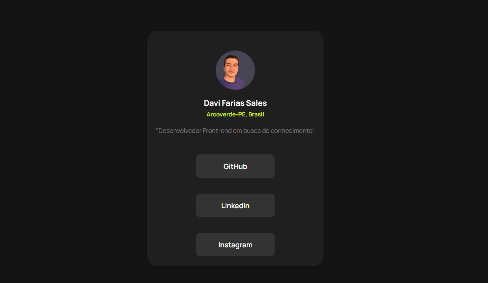
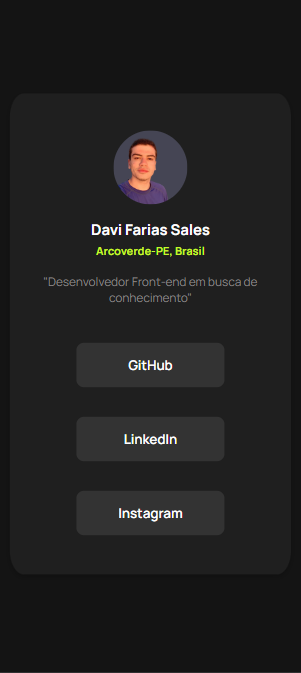

# 🎯 Interactive Rating Component
Este projeto foi baseado em um desafio do Front-End Mentor, onde o objetivo era criar um pefil de links sociais.

**Link para o página do desafio no FrontEnd Mentor:** https://www.frontendmentor.io/challenges/social-links-profile-UG32l9m6dQ

## ✅ Funcionalidades

- Design bonito e moderno
- Design reponsivo para despositivos mobile
- Efeito visual interativo nos botões
- O usuário pode selecionar qual rede social quer visitar e a mesma será aberta em outra janela

## 🤖 Tecnologias utilizadas
HTML5 | CSS

## 💡 Desafios
Meus maiores desafios foram:

- Colocar em prática as habilidades de design usando CSS e HTML
- Se inspirar no design de um projeto do FrontEnd Mentor utilizando HTML e CSS
- Destribuir bem as funções de cada tecnologia

## 🚀 Aprendizados

Durante o desenvolvimento deste projeto, aprimorei habilidades essenciais em **HTML** e **CSS**

Este projeto foi um ótimo exercício prático para reforçar conceitos de **lógica de programação** e **Organização e design limpo**, além de melhorar minha compreensão do **frontend**. 🚀

## Demonstração

## Design responsivo para mobile

   
Obrigado pela atenção :v